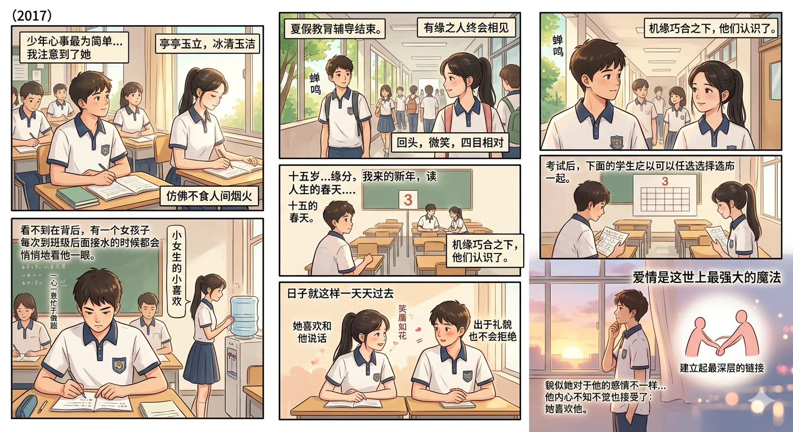

# 😁 西安爱情故事素材库

> 写给那个满眼都是我的女孩

***

## 偶遇之后的相遇

少年心事最为简单，无非为偶然遇见便倾心的女生，或为学业之进退。2017，那个时候他还在初中，学校组织全校学习较好的学生进行集中培训。培训过程中，他注意到一个女孩子，一个人坐在那里，亭亭玉立，冰清玉洁，仿佛不食人间烟火。

所谓一见倾心大抵如此，可是时间流转，他也便忘了这次偶遇，只不过冥冥之中自有定数，缘分便由此展开。

时光流转，有缘之人终会相见，暑假补课结束的某个时候，他在往外走，突然瞥见一个女生，回头，微笑，看着自己，四目相对，这才是最初的样子，一段感情最初开始的样子。夏日充满了燥热，蝉鸣，他只能注意到这些最为明显的事务，却看不到在背后，有一个女孩子每次到班级后面接水的时候都会悄悄地看他一眼。他这种男孩子，一心一意忙于做题，完全是吧不会注意到这些的。但是这并不影响她对于他的那种小女生的小喜欢。

十五岁，孩童和青少年的分界线，少男少女们都会在心里面对异性生出不一样的情愫，那是青春的气息，就像春天的第一抹花香，如此动人，美好。他和她的相遇便是在十五岁这个人生的春天，第一次考试之后，成绩优异的学生有权利优先选座位，她和他不约而同地选择了第三排，或许是她为了离他近一点，或许是他希望认识这个女孩子，或许是缘分。总之机缘巧合之下，他们认识了。

人们常说日久生情，但是爱情这个东西，有就是有没有就是没有，日久可以有亲情，可以有友情，但是很难有爱情。人们传颂爱情，就是因为爱情的稀有。爱情是这世上最强大的魔法，让两个素不相识的人建立起最深层的链接。让无力者有力，让无心者沉沦，让无形者有形。

日子就是这样一天天过去，她喜欢和他说话，他出于礼貌也不会拒绝，但是渐渐发现貌似她对于他的感情不一样，每每回头都是笑靥如花，喜欢和他有多一些接触，交流，即使是最迟钝的人也会发掘这其中的暧昧因素。他内心不知不觉也接受了：她喜欢他。

第四次考试结束之后，有人谣传男生有喜欢的人了。女孩子一脸失望和委屈，小心翼翼地问：你是有女朋友吗？

男生看到了她失落的样子，内心有点小窃喜，思量着：这女的喜欢我吧？

其实什么都没有。

女孩子破涕为笑，没等放学就一个跑到一个偏僻的地方，看了纸条，结果上面什么都没有！一开始是困惑，为什么什么都没有？后来想到了这小子有耍滑头。 

## 感情中的波澜

> 他在这头误解与吃醋，她在那头自然与无辜，中间是看不见的距离(chatGPT的评价)

青春期的女孩子总是活泼可爱的，但是活泼可爱在没确定关系之前，总会造成不必要的误会。因为在阳光下蹦蹦跳跳的可爱女孩大家都喜欢，男孩子也怕失去，可是小孩子终究是小孩子，只会用生气不理你来回复，完全没有成年人的那种将自己的需求讲清楚的意识。

青春期的男孩子敏感，会因为蛛丝马迹就觉得不正常，会因为女孩和别的男生亲密就心生醋意，会因为其他一些小事情就发脾气，可是这都是青春的气息呀，因为小孩子都是这样的，简单的脾气，毫无掩饰的爱意，莫名其妙的嫉妒，不定期的吃醋，以前看来是负担，现在看来也是一种甜蜜的回忆。可惜那时的他和她都不懂，等到懂一些的时候，却发现两个人不会再相见了。

一个寻常的午后，他发现了她和别的男生互动太过热情了，他瞥见女孩和别的男生有说有笑，可是他在心中暗自思量：她不是对我比较好吗？难道她的好不是只给我一个人？难道所有人都能得到她的好？我不是她心中的唯一码吗？

这件事给他的感觉自己只是她可有可无的一个选项而已，他生气了，他不知道一个喜欢自己的女孩子，为什么要和别的男生互动这么亲密，他只想她和自己亲密互动，诉说只有他们懂得暗喻，分享生活中的琐事，但是这一切都不现实。男生是生气了，就像其他小孩子一样只会用不理你的冷暴力来互动，总想着报复回去，让她也体会一些不愉快。正好，女孩子多次表达想要和他一起坐一起，因为物理距离的相近会让心灵也更近一些。想到这里，小孩子的报复心理作祟，让他做出这个决定：不和女孩坐在一起了。在换座位那天，他直接离开了，直接展示自己的生气，其实是看不懂的嫉妒？小孩子气的报复？或者是其他不知道的情绪。反正就是分开了，男孩心中思量：其实分开也没什么不好的，甚至暗爽？但是结果就是这样，男孩分开，给女生的展示就是女生对男生热情，但是男生对女生冷淡，这种无声无息的冷淡最让人伤心，他们的关系就冷了下来，一段时间内完全没有任何互动。其实男孩也看到了女孩子一个人在那里暗自神伤。

女孩子是不甘心就这样结束。她一天晚上尝试性地问道：咱们有什么误会吗？他面无表情地看着，轻飘飘地来了一句没有？一句轻飘飘的没有就是一扇无情的高门，将有心者拒之门外错过了。自然而然，男孩错过了和她和好的机会，本来就没有什么矛盾，但是就是不正确的两性关系处理方法导致了这种错误，于是两个人的接触便越来越，知道趋近于暂停。

暂停，暂停？

这不是暂停，这是人的心脏停止了跳动，如果没有及时的复苏，那么最后的结果就是死亡？

有人不希望这种情况出现，是谁呢？

她！

男生是没有这种自觉与主动，因为他什么都不懂，还是自私自利，自卑自傲，不知道天高地厚，不知道感情需要维护，不懂别人地喜欢不是自己的耀武扬威的工具，更不知道这世上最珍贵的就是真心，真心呀真心，世上无价之物。所谓无价，应有两种内涵：其一为一文不值，其二为千金不易。他那个时候还年轻，不懂得真心的价值，更不懂得生命中所馈赠的礼物早已在暗中标好了价格！他以为破坏这段关系是武侠小说中的快意恩仇，刀光剑影，但是去没想到武学至高境界是以柔克刚，与人为善达到天下无敌之至高境界。一开始的离开很痛快，甚至有些愉快，但是渐渐的他发现没有人和他那样亲密的互动了，一开始是有些无聊，男孩子觉得可以用别人替代她，反正自己高大帅气，不怕没有女生互动，但是正当男孩以为分开这件事可以很简单的时候，他忘了自己其实还有一点真心。

每当万籁俱寂的时候，他在夜里不止想念那个女孩子，回忆如潮水，一幕幕涌向心头，他一个人在书案前俯首书写时，脑子里面止不住地冒出来她地一颦一笑，想起来她的笑靥如花。

男孩想和女孩子说话，但是他不能做到，于是他试着集中自己的精神来对抗这种痛苦，他觉得自己拥有最强大的意志力，他用心灵地力量可以克服这世界上的一切痛苦。他紧绷着肌肉，就像将要赶赴战场的斯巴达勇士一样，他可以守住自己的心理防线，可是他却找不到敌人，因为这场”战争”最大的敌人不就是他自己吗？他自己喜欢上人家，却觉得人家和别的男生互动不切当，最后冷落人家，从始至终，她没有说过一句伤害他地话，没有做错一件事，这样的女孩子偷偷在他心里面留下一颗种子，现在已经和他融为一体。可是他却想把自己的一部分挖出来，就像那个唐吉可德一样，将风车当作邪恶的巨人，呼唤出来自己的骑士勇气，朝着不存在的敌人冲锋，最后只能是失败。

夜凉如水，人心不稳，男孩子不知道做什么，甚至心中有隐隐的绝望，因为自己的无理取闹，到了今天这个局面。在夜的最深处，总会看见一张温柔的笑脸，在清醒与模糊之间，闪耀，妖冶如火。这种鬼魅般的思念让人神伤。自己的本来聚拢的精神就在这种日复一日的抵抗中消散。

在经历种种痛苦的折磨之后，男孩也承认了：自己不能没有女孩，自己心中的倔强抵挡不了无止境的思念与相见。

狮子被降伏了，白昼初现，黑暗骑士也将归于黑夜。

## 和好

（2026.4.29写于北京西站，因为站内没网所以不修改论文了，我要写他的爱情故事！）

千里之堤，溃于蚁穴。即使是最强大的堡垒也会轻而易举地从内部被攻破，内心的倔强开始松动，高傲的头颅慢慢低下。平常的午后，学生们进进出出，大家有说有笑，他面无表情地行走，只想回到教室里面，生活就是这样的无聊，他自从暂停了和女孩子的互动之后，生活也变得那么无聊。可是在转角处又遇见了她，女孩子率先发出了一声：你好呀！他也回应以微笑，说了句：你好！

就如同黄河凌汛一样，大河上下都知道冰封的河流要解冻了，这一条活水本不应在这春天被封印起来，毕竟大江东去，入海流才是应有之义。

不知是怎么样，反正互动又开始了。一开始是在门口。打招呼。后来嘛是。正经和他说话Z知道那一天。 那一天是2018年4月5日。是陕西省中考体育的考试我们一起去了长二中进行体育考试回到班级之后，大家都去吃饭了他，我坐在自己的椅子上，他也贴过来。把身体把肩膀贴到我的肩膀上，然后。问我物理题或者是说一些什么闲话？我回赠了他一个小包装的11架就是里面空无一人，两个人在那里不咸不淡的说着beyond的话哎呀，看似普通，其实双方都知道。关系已经解冻了。诶，因为有了实际的肢体接触温暖的力量可以被传递消融一切的隔阂与误会。没有人会问之前是什么情况，因为大家都是所谓的体面人但是都知道接下来应该怎么办。接下来应该用热气来回应彼此日子过得很快我们就这样在那里不咸不淡的说着。身体接触。灵魂的隔阂也开始消融。日子过的飞快，接下来是长安区第一次统考，2018年的统考，大家都在努力的准备着，直到统考结束的那一个下午，天气阴沉沉的。但是由于统考的压力消散。男孩子感到十分轻松，于是。别人一个人走出去，然后。双手搭在那个。单面楼的护栏上在那里看的证。艳的桃花，那花开的粉扑扑的。正如这初夏的。恋情一样。让人动。这时候男孩子心里面在想如果这个时候女孩子在我身边就好。不知是天意还是什么。过了一小会儿，有一个女生突然从背后传来。说你在干什么？男孩子，回头定睛一看。居然是他真的是他呀，他真的来了。于是两个人在五楼的。护栏上，一面吹了凉风。天气也不是很炎热。一边不咸不淡的聊着一些话。具体什么话没有人记得了但是只记得那天天气微凉。让人心驰向往。那是一个轻松的日子，那是一个甜蜜的日子轻松是因为大。好之后，压力消散了。甜蜜是因为天气舒适，桃花盛开，身边有女孩子心爱的女孩子相伴。直到某一天早上，他说可以班主任说女孩子要调座位班主任。声音不大不小，说一声同意然后女孩子便拉着自己的东西又重新坐回了男孩子身边女孩子是一个勇者。他勇敢掀开了那道大门从此之后再也没有什么能够抵挡他们他们便坐在一起。女孩子常常会坐在椅子中间，因为她想离那还是近一点？男孩子也知道这样，所以他会特意往旁边坐一点。不是不想。离女孩子近一点觉得众目睽睽之下。有一点点尴尬在某一个寻常的午后，男孩子先一步到了教室坐在了椅子上，然后双手撑在凳子上。这时候女孩子进来了。不只是随意的，还是故意的。女孩子把手放在了男孩子手上面那一刻，时间很漫长那一刻时间又很短暂。这是第二次男孩子的手接触到女孩子的手这也是第二次，这也是。两个人心意相通的瞬间情侣嘛，总是要多拉手的。因为。牵手，才能够接触到彼此。接触，其实是心灵相通的前奏。 S陕西省中考是6月27号28号。在中考之前。女孩子很焦虑，因为她的成绩并不足以考上和男孩子同样的高中所以他一直对男孩子。委屈巴巴地说，不要忘了你不会忘了我。男孩子只是淡淡的微笑，并不回应因为他心里暗自想到这怎么可能会忘了。其实他本不应该沉默的，他应该把话说得更明白一些他当然不会忘记，因为内心的喜欢又怎么会轻易忘记呢？诶，那些一起度过的日子一起吹过的晚风又怎么能轻易的。说走呢，说走就走呢。

很快就到了。在学校的最后一天。大家都把做完的卷子整理然后准备离校Town女孩子晚上给男孩子发消息说我们明天一起去学校里面再自习一下好不好？男孩子满口答应了，但是第二天不知怎么到睡过了，并没有去赴约女孩子于是便给男孩子发消息说你来晚了学校里面已经没人了就我一个人门卫让我走所以我不得不走了你也不用你不用来了。是啊，这只是第一次错过而已。没什么大不了的，男孩子心里想着。但是男孩子忘了圣人的祖训。生于忧患，死于安乐。所谓积土生成山。积水成渊一点点小的失落终究能汇成大的失望。最后砸碎它，做真实的东西他最真实的东西是什么呢？当然是哪一份感情了

6月26号。所有学生都要去查二中，提前看考场女孩子给男孩子发消息说咱们俩一起去看考场。我在西寨村的门口等你还主动发送了自己的电话号码，说如果有急事的话可以打电话给他真好呀。两个人第一次在学校外面见并肩而行，途中还遇到了一个老朋友。两个人并肩而行的时候。不咸不淡的说着很多话很放松，很惬意看完了。就是之后不知怎么的男孩子没有和女孩子一起出学校，甚至没有一起出校门口。是因为男孩子为了显示自己的社交圈比较广泛。所以转头就和别人说话竟然冷落了女孩子？究竟是什么原因呢？反正大家都不记得男孩子也不记得了，女孩子也不记得了。中考是很快的。大家很快就考完在考历史的时候，男孩子迟到了所有人都已经进学校。只有女孩子和另外一个她的闺蜜在学校等候着男孩子到来给男孩子提供他所需要的信息为了孩子守住那一份更高分数的希望帮助他能够在前进嗯，男孩子因为考试压力过大，忽略了很多其他的要素。感觉整个人就是一台考试机器，完全对外界的扰动无动于衷，感觉整个人都不太正常。直到考完了。他很轻松，于是便直接从窍门里面走出去了殊不知，女孩子对此很生气，因为男孩子没有和女孩子一起走出校门。本来这个时候应该是男孩子主动的，但是他没有，只要女孩子一个人走出去了。女孩子很生气。诶嗯。6月29号考完贺第一天，阳光正好男孩子终于睡了一个懒觉。因为他考完了完全没有其他活可以干于是呢，他便给女孩子发消息说，今天一起玩吧。但是发了一天的消息，女孩子不用理他事后才知道，女孩子去跟他妈妈买衣服，所以没有理他。男孩子想跟他出去玩，女孩子说，要不咱们再多叫几个人吧。男孩子其实内心里面有一点点小失望，因为它是两个女孩子一起出去玩。并不想和别人。

啊，那就接着诉说我们之间的事情吧，大概是4月5号之后某一天的晚自习下，第三节晚自习下了之后我走出来那栋楼，然后在楼下看到了她和她的闺蜜在打着伞朝前走着啊，那就接着诉说我们之间的事情吧，大概是4月5号之后某一天的晚自习下，第三节晚自习下了之后我走出来那栋楼，然后在楼下看到了她和她的闺蜜在打着伞朝前走着，那个只有路灯发着光光，这个桃花树开的正盛开的正盛，桃花树开的正盛，粉红色的桃花，绿色的叶子，层层交织，光线透过这层层的阻拦，洒向地面光明与黑暗，在地上绘出独一无二的画卷。和他以前以后虽不说话，是夜凉如水，十分冷静静静，谧静人心驰神往

啊我第一次，试着约她是在中考完之后的那一天，那天清晨我醒来无所事事，因为考试完了，我没有事情要去干，睡自然醒，然后我就拿起手机习惯性的给他发消息，但是他没有回我，直到下午的时候才跟我说他妈妈出去买衣服，那个女孩子呀，你为什么要去和妈妈买衣服呢？然后我们在高考完那几天下午也是经常聊天的 ，我清楚记得我我他有给我表白的迹象，我给他说的是我爱爱我的人，其实就是给他偷偷说情话，那个女孩子你怎么不给我表白呢？如果表白的话，咱们俩那个时候就能够成的

后来的后来是我们俩第一次出去约会，我记得那一天我没有洗头，也没有刮胡子，什么都没有干，随便找一身新衣服穿着出去了，直接去韦曲南地铁站里面找他，但是他不在韦曲南，他在航天城，因为他跟我说他爸爸把他送到地铁里面，之后他爸爸又问他你为什么还没走，他连着他爸爸的wifi，所以他就先坐了一站到了航天城，但是我现在看下来的话，有可能是他先坐一站，骗他爸爸，然后，在那里等我而已。

那天真的好热呀，我们俩一起去了哪里？我忘了，好像是汉唐还是开元书城去那里买书吧？我不知道呀，谁能知道呢？期间还碰到了其他的高中同学，但是碰到就碰到了，也没有什么用。

## 分手素材
我大致讲解一下我们的分手历程第一次分手。，是在2020年的夏天的某个。上课，日子提出来的。我们发生了争吵，然后我把他拉黑了。嗯，等到线下见面的时候。他说我们能不能不要分手？我说不能，然后她就跑开了，哭着跑开了然后中午的时候。太阳很热，他一个人在班级门口等着我。我注意到。然后有些有个同学跟我说他在门口等着你。然后他又说我不想和你分手。然后。我一直在那里。说我不同意，我就要分手。然后轻拍了他的肩膀，他这时候。大声的说，不要碰我后来在他的记忆劝说下我勉强同意和他继续复合。但是我依然是。不太看重，不太珍惜我们之间的感情。最后一次分手是在2020年9月30号。呃，我们一起吃完饭。他要请我吃饭，我说。没事儿咱们俩a吧？然后他给我提了一句。他说，最近我老是问我有没有在谈恋爱，我说没有。我当时没有听出来这句话的弦外之音。然后往回走路上。我的提出你能不能不要跟那个男生再接触了？他说你之前也和别的女孩子一起处。然后我当时非常生气。就和她提出了分手？分手之后。我。他就不理我了但是我内心觉得不甘就通过。把之前他送给我的东西还回去给我写的情书还回去的方式。嗯，来故意刺激他吧想让他知难而退。但是他这一次并没有知难而退。而是一给我送来了分手信。啊。直到那一刻我才意识到他原来是来真的。第二天晚上我去找他说我想复合，他说他现在没有喜欢的人，也没有答应我的复合，也没有拒绝我的复合。后来我们还继续保持着。之前是男女朋友吃的习惯。我们一起在操场上遛圈儿。一起吃饭，一起喝奶茶，一起上自习。好吧手。放到他的腿上。他说，教室里面有监控，小心老师给你抓起来。他没有让我把手拿开。那一刻，我真的有一种幻觉仿佛我的关系得到了修补。有一次我打篮球，我的右腿积液了。他看到了，十分着急。他说你为什么腿不结了还不赶紧去医院？然后他找了老师，接着老师的手机给我家长打电话，让家长把我接走。当时他和我的非常讨厌的一个女生关系很密切。我非常讨厌她那个闺蜜。他们俩一起走在路上他跟我打招呼，然后我没有理他。嗯，很多次都是这样的。导致了。我们的关系。渐渐冷淡下来。然后。高三。上学期期末吧，有一次。在路上，他跟我打招呼，但是我没有理他。我当时是想理他的，但是。他看到我没有理他就走开了。我当时却没有告诉他，我是想理他的，也没有追上去继续跟他说话，所以就让他以为我不想理他。然后就是他在他过生日的那天他的18岁生日那天。呃，发了他和另外两个男生一起出去过生日的照片里面还有他的家人。我当时非常生气然后我就约了另外一个喜欢我的女生出去玩儿，我想。久游这个来提醒他一下，我也是有别人可以选择的。然后就是一系列灾难性的后果我。他不想跟我讲话然后我死皮赖脸的跟他去讲话。他就用很生气的语调。来跟我讲话？最后一次讲话是在咪咪小面吃完饭以后他就直接走了。我再次遇到他的时候。是在一北楼。的思潮，我看见他一个人在那里黯然神伤。我试着走过去跟他讲话。但是他并没有理我。然后我就扭头走开了。之后，他依然像往常一样下楼来。但是我没有理他，我只是在远远看着他，他也看到了。他也看到了我，但是我们两个人。没有谁和谁去讲话。直到它不再出现在操场上我还是一个人走在操场上。直到。我们之间没有什么话可以讲知道。他再也不理我。
