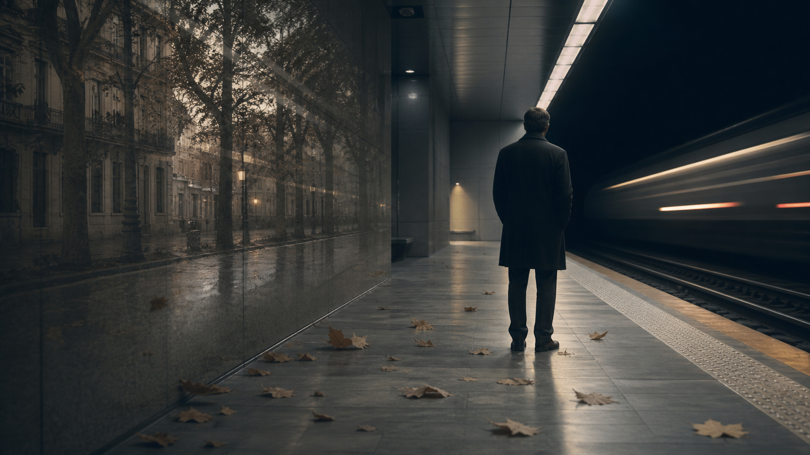
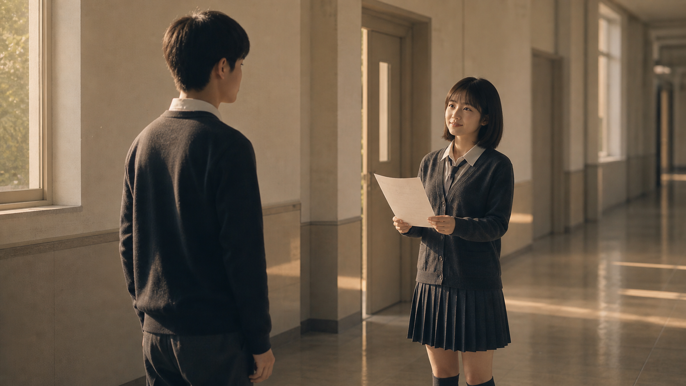
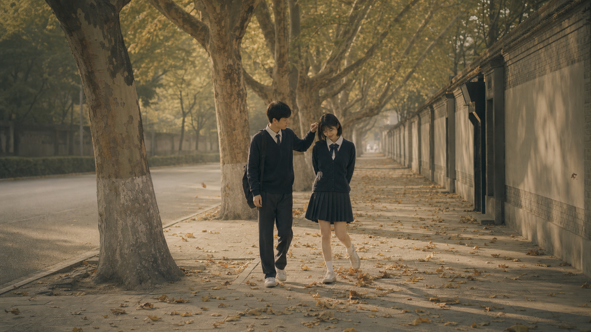

# 他的痛苦来得太晚了

## 一

那天晚上他不过是下班晚了，在地铁上多坐了几站。

车厢里没什么人，广播报了一个站名，他忽然抬起头。那个站名本身没什么特别的，但他记得，很多年以前，他和一个女孩曾经在这一站下来过很多次。出了站往北走，会经过一条种满了法国梧桐的路。

那是他第一次在这个城市过秋天。女孩走在前面一点的位置，梧桐叶子很大，几片叠在一起落在路面上，她踩上去，叶子发出很脆的一声响。她回头看他说，你听。

他听见了。但他当时没有什么特别的感觉。叶子而已。

那天晚上他在下一站下了车，站在站台上，列车从身后开走，风灌进隧道里，发出很长的回音。他已经很久没有想起她了。但今晚他想起来了。

想起来的不是某一件事，而是一整段时间。从十五岁到十八岁，他和她共同拥有的那几年，像一卷旧胶片一样在他面前铺开。他站在站台上，不太确定自己应该往前走还是继续站着。

列车已经走了。

## 二

初三那年重新分班，她被分到他旁边。

说是旁边，其实隔了一条过道。她每次去教室后面接水，回来的时候都会从他这边绕过去。不绕也可以的，教室有三条过道。她选了他旁边那条。

他注意到这件事是在开学后的第三周。他的同桌说，那个女生好像老看你。他说，没有吧。同桌说，有。

他抬头，正好撞上她的目光。她被发现了，愣了一下，笑了一下，低下头继续写题。那个笑他后来想了很多次——不是不好意思的笑，是"被你发现了那就发现了吧"那种笑。

她没有躲。她从来没有躲过。

后来换座位，她选了他旁边。他们的距离从一条过道变成了一本书的宽度。他开始和她说话。她说话的时候喜欢微微偏着头，声音不大，刚好是他能听见的程度。好像她说的所有话都只准备给他一个人听。

班上开始有一些声音。说某某女喜欢某某男之类。他没有在意。或者说，他在意的方式是假装不在意。他发现了一件事：被一个人喜欢的时候，你会不自觉地觉得自己可以慢一点。她会等的。她不是一直都在吗。

有一次月考后，她和邻班一个男生在走廊里说话，大概是学生会的事。他隔着窗户看见了，心里翻了一下。当时他不觉得那是吃醋——他觉得吃醋这个词太严重了——他想的是：她怎么也能和别人笑成那样。

那天下午他没怎么说话。她问他怎么了，他说没什么，就不说了。

第二天换座位，他没有和她坐在一起。他要让她知道，他不高兴。至于为什么不高兴，他觉得她应该能看出来。她不是喜欢他吗，如果喜欢他，就应该懂他。

她后来确实来找他了。那天放学，她走在他后面，脚步很快地追上来，问了一句话。她的声音和平时不太一样，没有笑意，但也没有恼怒。更像是很认真地在确认一件事。

"我们之间有什么误会吗？"

他说："没有。"

她等了两秒。他没有再说话。她就走了。

很多年以后他想起这个瞬间。两秒钟，一个人可以等两秒钟。她在等他多说一句话。哪怕他说一个"不"字、"其实"——他什么都没说。

过了一段时间，她不记得是在哪节自习课了，她忽然又转过头来和他说话。语气和从前一样。她说你数学作业最后一题做出来了吗，他愣了一下，说做出来了。她问怎么做，他讲给她听。讲完之后她笑了，说谢谢你。

就是三句话。那道数学题，那个谢谢。她又走回来了。

他没有细想过这件事。他当时只是觉得，这样就好了，又和以前一样了。他没有去想一个人走到他面前来，重新开口说话，重新对他笑，需要多大的力气。他以为是自然而然的事。

## 三

中考出成绩那天他们在学校见面。她考得很好，全市前几十名的水平，去省内最好的高中没有任何问题。他考得一般，估分的时候就已经知道，大概只能去省内第三的学校。

他们已经早恋了，如果这算早恋的话。是一种不太明确的、没有说破但是双方心里都知道的状态。他在教室外面等她，她从办公室出来，手里拿着成绩单。

"我们去哪个学校？"他问她。

她看着他，停了一下。然后她说了一个校名。不是最好的那个。是他能去的那个。"我填了你们学校。"她说，"我爸昨天发了很大的火。"

他站着，不知道说什么。他记得自己当时是高兴的，但高兴的同时又觉得有什么东西压着。一个人把自己的选择给你，你就欠了什么东西。他那时候还不太会处理欠的感觉。

"你应该去最好的那个。"他说。

"我知道。"她笑了一下，"我乐意。"

她说"我乐意"的时候眼睛很亮。那不是牺牲者的神情，不是委曲求全。她做这个决定的时候是高兴的。她把他放进了一个很重要的位置，也许是她十五岁的世界里最重要的那个位置。她不是不知道代价，但她付了。

他后来想，他这辈子可能再也不会听到第二个人对他说这三个字了。

## 四

高一那一年是他们之间最好的时光。

西安对于两个从小城市来的少年来说太大了，也太亮了。他们周末会约在钟楼见面，然后沿着南大街往下走，穿过南稍门，走到省体育场。她不认路，跟着他走。他其实也不怎么认路，但他不说。两个人就这样在西安的街道上走错了很多次，每次走错，她就笑他，他也不反驳，继续在前面走。

然后她还是会跟上来。

他们最常走的是友谊东路和友谊西路。这两条路的名字好听，路两边种满了法国梧桐，树冠在头顶合拢，像一道很长的绿色走廊。他们并排走，靠得很近，肩膀偶尔碰一下。她穿着校服外套，袖子有点长，手指缩在袖子里，只露着指尖。秋天的风从北边吹过来，带着一点凉和尘土的味道。她在风里眯起眼睛，头发被吹乱了几根，他伸手去拨了一下。

拨完之后他的手停在半空，不太确定自己应该放在哪里。最后放在了自己的口袋里。她看了他一眼，没说什么，嘴角收了一下。

那段路上梧桐叶子铺得很厚。她故意走得很重，每一脚都踩出声响。他说你干嘛，她说我喜欢这个声音。

他们有时候去省图书馆自习。省图的自习室很大，很安静，每个人面前摊着书和试卷。她坐在他对面，低着头做题，头发垂下来挡住了半张脸。她写完了卷子的最后一道题，放下笔，长长地呼了一口气。这个细节他后来一直记得。不是什么特别的画面，就是她呼了一口气。

他当时抬头看了她一眼。阳光从窗户照进来，照在她脸上，鼻梁上有一小片光斑。他想，她真好看。他低下头继续做题。

他没有说。

他那时候总觉得很多话不用说。她觉得她应该知道。他都看了她一眼了。他都想过了。还不够吗。

二号线是他们最常坐的地铁。从他们学校附近坐四站到钟楼。地铁车厢里灯光很白，窗外的广告牌飞速闪过。人少的时候，他们并排坐着，她靠着他，头发蹭到他的衣领。她的头发很好闻，是一种很淡的洗发水味。他后来在很多年里，偶尔闻到类似的味道，都会愣一下。

他们回来的路上，如果在晚上，可以看见地铁窗外的城市一片一片暗下去。南稍门、体育场、小寨，一路往南，人越来越少，车厢里越来越空。有一回她靠在窗边打瞌睡，头一点一点往下沉。他把手掌垫在窗户上，让她的额头靠在自己的手背上。她的手很凉，车窗玻璃很凉，他的手心是暖的。

她醒来的时候抬头看他。那个眼神他后来怎么也忘不掉——不是感动，不是深情，而是一种安静的、放心的神情。好像她确认了一件事：他是可以被依靠的。

那一年他十七岁，她也是。他在友谊路上走着的时候，不太确定自己是不是在恋爱。但他知道，这大概是自己人生里最好的一段日子。

## 五

疫情是 2020 年初来的。

一月底，西安的学校全部停课，各自回了家。走之前他们在学校门口见了一面，她说过完年就回来了。他说好。结果那一年他们在家里关了很久。一开始他们在手机上每天聊到很晚，从天亮聊到天黑。聊什么呢，其实没什么具体内容。她说她在家做了红烧排骨，他说他那边的网课卡得不行。都是一些轻飘飘的话题，但在那个不能见面的冬天，这些话就是他们之间唯一的联系。

后来时间长了，距离开始起作用。

回消息的速度从几分钟变成几小时，从"我睡了晚安"变成看了消息隔天才回。有一回他说了一句什么，她不太舒服，没回复。他等了一阵，看到对话框里什么都没有弹出来，就放下了手机，也没再发。

以前在学校的时候，不说话是可以的。因为抬头就能看见。但现在他们的关系全靠文字维持，文字是没有表情的，没有语气，没有温度。一次不回复就是一条裂缝，隔了一天就是两条。

复课之后，他发现有什么东西变了。

她还是坐在那里，还是会和他说话，但她笑的时候眼睛不再像以前那样亮了。以前她的笑是不需要理由的，她看见他就想笑。现在她需要理由。他说了一个什么好笑的事，她笑一下。他不说，她就不笑。

他感觉到了，但他不知道怎么办。他不知道怎么修复一道看不见的裂缝。他唯一会用的办法，和初三那年一模一样——沉默，回避，冷淡。他以为这样会让她注意到他的不满，然后她会像以前一样走回来。

有一个下午，他在操场上和别人打篮球。打着打着，他抬头看见她站在远处。她就站在那里，没有走过来，没有招手，没有说话。隔着几十米，她的表情看不清楚，但她的姿态很安静，好像在想什么事情。然后她转身走了。

那个转身他当时没有在意。他手里拿着球，队友在催他。他只看了一眼就把头转回来了。

他后来花了很长时间，反复地、一遍一遍地回想那个画面，试图回想起她脸上的表情。他记不起来了。他只记得她站得很直，背影不像是生气的样子，也不像是伤心的样子。更像是一个人站在那里等了一阵，确定没有人在意她，然后就走了。

那是他最后一次看见她站在远处等他。

## 六

分手的导火索是一件很小的事。

高二下学期一个周末，他们约好去省图自习。他早上起晚了，到的时候已经快中午。她坐在老位置上，面前摊着试卷，一个字也没写。她说，我以为你不来了。她说话的时候没有看他。

他说，我起晚了。

她低着头说，你最近总是起晚。

他忽然觉得烦。不是对她烦，是对这种局面烦。他烦自己每次都迟到，烦她不高兴，烦这段关系正在变成他不认识的什么东西。但他不知道怎么说这种烦，于是他说，那你下次不用等我。

她抬起头看他。那个眼神他后来想了很久。不是愤怒，不是质问。更像是她在看着一个她已经不太认识的人，想要确认你是不是真的说了这句话。

她说，好。

那个月他们没有再见面。

## 七

分手信是在一个周四晚上到的。

他的微信上弹出了一条消息，很长。他没有想到会是一封信。他靠在枕头上，看着屏幕上的那段话。第一句是："我试着写了两次，都删掉了。这是第三次。我不确定这次能不能写完，但我决定不再删了。"

信里写的不是他的错，是她的记忆。

她说她记得初三那年换座位，他一个人走了，头也没回。她坐在原来的位置上，旁边的位置空了一整个下午。那时候她想，是不是自己哪里做错了。后来她发现她没有做错任何事，只是他习惯了用沉默解决一切。她说："第一次你不理我的时候，我来问你是不是有误会。你说没有。我信了。我后来发现不是没有，是你觉得不需要解释。那次我原谅了你。后来的每一次，都是我在原谅你。"

她说她记得中考后填志愿那天，她爸在电话里骂了她很久。她挂了电话一个人在房间里坐了很久，然后给他发了消息，说"我填了你们学校"。她发这句话的时候想了很久，想说一些更轻松的话，最后只打了那六个字。她说："我从来没有拿这件事压过你。我告诉你，是因为我真的很高兴。那个时候只要和你在一起，去哪里都行。但是后来我一直在想，你为我做过什么同等的决定吗？我想不出来。"

信的最后一段是这样写的："我们第一次冷战的时候，我十五岁。我以为喜欢一个人，就是要包容他所有的脾气。现在我十七岁了。我花了两年时间才明白一件事：包容和被消耗是两回事。我不怪你，你也没有做多坏的事。但是我不等你了。"

"我不等你了。"

后来他反复看这句话。信里没有一个"恨"字，没有一句质问。她不是在控诉，她在做清点。她把这些年她给出去的东西、他一直没有还的东西，一件一件拿给他看。不是因为想要他还，而是因为她放下来了。

## 八

他读完信的当天晚上就找她了。打电话、发微信、找共同的朋友。他的行动力在那天晚上达到了他整个青春期中最高的程度。但已经晚了。

她回了一句消息：我们已经说清楚了。

他说，我改。你给我时间，我改。她没有再回。

但他不甘心就此结束。他在接下来的一段时间里，一边试图挽回她，一边又觉得自己的自尊被伤害了。他问她朋友她最近的动态，打听她是否有了新的生活。与此同时，他开始生她的气。他想，是你写的那封信，是你离开的。我又没有做什么伤天害理的事。凭什么你就能决定结束。凭什么只有你在信里列那么多条。我也有委屈。

然后他做了一件事。他约了另一个女孩出去玩。

那天下午，他们去看了电影，吃了饭。晚上他送那个女孩回家，在路上走的时候，他觉得自己恢复了——你看，我已经从那些事情里走出来了。我不是非她不可。

这当然不是真的。他的手插在口袋里，脑子里想的全是前女友的脸。她的分手信里有一句话他一直在心里翻来覆去地想：我不等你了。他想起高一那年，有一天在地铁上她靠在他的手背上睡着了，醒来时看他的眼神。那是一种信任的眼神。她信任过他。现在那个眼神没有了，他在这里，在一个不相关的人的旁边，假装这件事没有发生过。

后来她知道了这件事。

她是怎么知道的，他不确定。可能是共同的朋友，可能是别的什么。他曾经发过一条消息给她，对话框里弹出了红色的感叹号。她没有删他好友，她是直接拉黑了。

从此再无回音。

那个她等了两年的男孩，她终于不等了。连黑名单都是绕过一步直接拉黑的——她已经不想再给任何一条消息留下抵达的可能。

## 九

后来就没有后来了。

高中毕业，大学，毕业，工作。他换了几座城市，谈过两段不长的恋爱，日子在不知不觉中往前推。偶尔他的朋友提起她的名字，他嗯一声，不往下接。朋友也就不说了。

他有时候会经过那些老地方。友谊路两边的梧桐还在，省图的自习室还在，二号线还在。他一个人走过那些路的时候，什么都没有想。不是刻意的回避，而是真的什么都没想。直到那天晚上，地铁广播报了那个站名。

他坐在车厢里，忽然发现那些画面原来从来没有离开过他。它们只是被存在了某个很深的地方，等着某一天一个站名、一阵风、一片树叶的声音把它们都叫醒。

他想起初三那年，她来找他问"我们有什么误会吗"，他回答"没有"。那是两个字。现在他知道，多说一句话可以改变什么。但他那时候不会。他那时候从来没有想过她会走。

他想起中考后的那个夏天，她对他说"我填了你们学校"。她说"我乐意"。她站在那时的阳光底下，头发的轮廓被照得发亮，对十五岁的他露出了全部的、毫无保留的笑容。他那时候只哦了一声。

他想起高二那年，她站在操场远处看他。他投了一个三分，球入网的时候他回头想看看她的反应。她已经走了。

他想起那封分手信的最后一句："我不等你了。"

他终于明白了一件事。她不是突然离开的。她的离开没有发生在写分手信的那个晚上，也没有发生在他约别的女孩出去的那个下午。她的离开发生在他每一次沉默里、每一次回避里、每一次他说"没有"的时候、每一次他明明知道自己应该追上去却停在原地的时候。

就在那些时刻，她一点一点地不再爱他了。每一次都不是大事，但每一次都没有被注意到。两年里上千个微小的时刻累积在一起，就是一个人从"我乐意"走到"我不等你了"的全部路程。

现在他终于知道了。他知道自己曾经被人用最认真的方式对待过。他知道了在十五岁到十七岁这三年里，有一个人把她的未来和他的名字放在一起想过，不止想过，她还真的那样去做了。他也知道了，他这一生大概不会再遇到第二个这样的人了。

他的痛苦是真的。

但来得太晚了。这份痛苦已经不具备任何对外的作用——不能换回她，不能弥补她，甚至不能让她知道。那个女孩已经走了很远的路。她的离开不是为了惩罚他。她只是不再需要他了。

窗外有车灯扫过去，橘黄色的、长条的光线划过天花板，停了一秒，又暗了。

他坐在那里。地铁在隧道里发出空洞的轰响，两节车厢连接处嘎吱嘎吱地摇晃着。下一站到了。

他站起来，车门开了。他走了几步，回头看了一下。车厢里空空荡荡的，座位上什么都没有。

他转回头，继续走。

没有任何人知道，他今晚和一个十五岁的女孩告别了。
